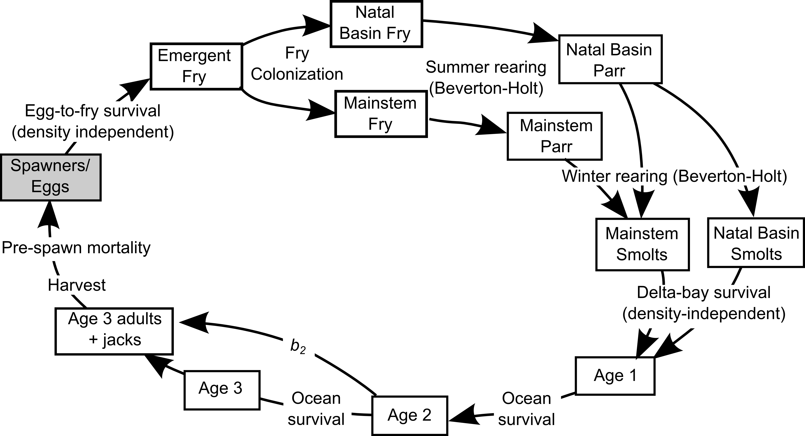

```{r setup, include=FALSE}
# TO RUN THIS NOTEBOOK, FIRST RUN THE COHO ASRP MODEL WITH STOCHASTICITY OFF

knitr::opts_chunk$set(echo = TRUE)
```

```{r, echo=FALSE}

print_nicely <- function(x){
 tibble(basins = names(x),
        value = x)
}

```

At the small group meeting on April 29th, there was discussion about the patterns seen when we adjust the spring and fall movement percents in the NOAA LCM. We are seeing a pattern where as we increase the percent of fish moving from the tribs to the mainstem in the fall (after summer rearing, prior to overwintering), the total spawner abundance for the basin decreases. The objectives of this document are to:

1. walk through the coho lifecycle model, explaining the transitions between stages
2. explore the impacts of spring and fall movement from the tributaries to the mainstem. 


# Walk through one coho lifecycle
Note *all 63 subbasins are included in each step*, but for purposes of illustration, this document will display a subset of those basins. As a reminder, the conceptual coho lifecycle looks like this:



In psuedo code format, this lifecycle can be written as follows. It is important to note that each variable is a `vector` of length 64. This means when if we execute `em.fry <- eggs * egg.fry.surv` there are 64 input egg values, 64 egg to fry survival values, and 64 resulting emergent fry values.  

```{r, eval=FALSE}
spawners           <- spawners[year.i-1] # spawners from previous year

eggs               <- hs.func(spawners, asymptote = egg.cap, slope = fecund) # spawners -> eggs, hockey stick
em.fry             <- eggs * egg.fry.surv # Eggs --> freshly emerged fry, density independent
fry.distributed    <- move.fish(fish.in = em.fry, spring.movement.rules) # move emerged fry to mainstem
fry.colonized      <- fry.distributed * fry.colonization # emergent fry --> fry, density independent
parr               <- BH.func(S = fry.colonized, p = fry.parr.surv, c = parr.cap) # fry --> parr, B-H function
parr.distributed   <- move.fish(fish.in = parr, fall.movement.rules) # move parr down to mainstem
smolts             <- BH.func(S = parr.distributed, p = parr.smolt.surv, c = smolt.cap) # parr -> smolt, B-H
smolts.reallocated <- move.fish.back(fish.in = smolts, reallocate.rules) # reallocate smolts to natal basin
age1               <- smolts.reallocated * bay.surv # smolts --> 1 year olds in nearshore

# Age structured return -- reliant on fish from previous year [year.i-1]
age2               <- age1[year.i -1] * ocean.surv # 1 year olds[year.i-1]  --> 2 year olds
age3               <- age2[year.i -1] * (1 - b2) * ocean.surv # (2 yo - jacks)[year.i-1] -> 3 yo
total.run          <- b2 * age2 + age3 # jacks[year.i-1] + 3 year olds
recruits           <- total.run * prespawn

```

Below here, we will walk through each step. The code below is true code, and so results that are displayed are calulated live in this example. 

## Read in data
The fist step is read in the productivity and capcity values which will be used to parameterize each transition. Those productivities and capacities are stored in a `habitat.sceanrio` file. We will use `Current.csv`.

```{r}
dat <- read.csv('../../outputs/coho/hab.scenarios/Current.csv', header = TRUE, row.names = 2) %>%
  select(-X)

colnames(dat) <- reach.names
dat <- as.matrix(dat)
dat[is.na(dat)] <- 0

dat[, c(12,13,40,63)] %>% round(3) # Display a subset of dat

```
From here, we assign each variable to a `vector`, or list of numbers 63 long. That way when we use one equation (e.g. `eggs * egg.to.fry.survival`) our input and output will both be length 63. 

```{r}

egg.cap <- dat["eggs", ] # Egg capacity
egg.fry.surv <- dat["eggtofry_surv", ] # Egg to fry survival

fry.parr.surv <- dat["surv_s", ] # over summer productivity
parr.cap  <- dat["capacity_s", ] # over winter capacity

parr.smolt.surv <- dat["surv_w",] # overwinter productivity
smolt.cap <- dat["capacity_w",] # overwinter capacity

S.up <- dat['prespawn_surv', ] # prespawn survival


```

## Spawners
To start the lifecycle, the input is a numbers of spawners per subbasin. We will use the `spawners` column and the `Current` scenario in the standard model outputs `coho_abundance_by_subbasin.csv`. This gives us a row of numbers or `vector`, of length 63, with integer values for the number of spawners per subbasin. A value of 0 means there are no spawners which return to that basin. 
```{r}

spawners <- read.csv('../../outputs/coho/lcm/coho_abundance_by_subbasin.csv') %>%
  filter(scenario == 'Current') %>%
  pull(spawners)

names(spawners) <- reach.names

spawners %>% print_nicely() 

```

## Eggs
To calculate the number of eggs, we use the hockey-stick egg function `eggs.func()` to transition spawners into eggs. The numbers of eggs produced is calculated by multiplying the number of spawners by fecundity (2500). This increases linearly until egg capacity is reached, at which point more spawners does not result in more eggs. Note `spawners` and `egg.cap` are unique to each of the 63 basins, but fecundity is fixed. 

```{r}

eggs <- eggs.func(spawners, egg.total = egg.cap, fecund = fecund) # fecund = 2500

eggs[c(12,13,40,63)]
```

## Emergent fry
Eggs to emergent fry `em.fry` is a density independent step. We multiply the egg abundance by egg to fry survival.

```{r}
 
em.fry <- eggs * egg.fry.surv

em.fry[c(12,13,40,63)]

```

## Spring movement
Next we move 5% of the emergent fry down to the mainstem. The movement rule is *fish from each tributary move down to the first mainstem unit encountered and stop there*. The rules defining which subbasins contribute to which mainstem units are defined by `move.matrix.spring`. This results in each mainstem unit being occupied by non-natal juveniles from one or more tributaries. 

Eventually non-natal juveniles will be reallocated to their natal basins based on the proportion of the total they represented when they first moved in, note the `return percent` rows. 

```{r}
fry.distributed <- distribute.fish(fish.in = em.fry, move.matrix = move.matrix.spring * percent.fry.migrants)

fry.distributed[,c(12,40,56)] %>% round(3)

```

## Fry
Once 5% of the fry are moved from their natal basins down into the mainstem, we apply the density independent fry colonization survival (0.78). We then run the resulting `fry` through the oversummer Beverton-Holt function, uniquely parameterized for each basin using `parr.cap` and `fry.parr.surv`. 

```{r}
fry.colonized <- fry.distributed['after_movement', ] * fry.colonization

parr <- BH.func(fry.colonized, p = fry.parr.surv, c = parr.cap)

parr[c(12,13,40,63)]

```


## Fall movement
After the oversummer survival, in the Current scenario we move 11% of `parr` down into the mainstem. The rule is `parr` spread downstream evenly from the nearest mainstem unit to the lowest mainstem unit. These rules are defined in the `move.matrix`. Now the mainstem units are populated by a mixture of `parr` from many differnet subbasins, some of whcih migrated as `fry` in the spring movement. 
```{r}
parr.distributed <- distribute.fish(fish.in = parr, move.matrix * 0.11) # Fall distribution into mainstem 
parr.distributed[,c(12,13,56)] %>% round(3)

```

## Smolts
Once the `parr` are moved, they experience density dependent winter rearing. The each subbasin has a uniqie Beverton-Holt parameterized by `parr.smolt.surv` and `smolt.cap`.  
```{r}
smolts <- BH.func(parr.distributed['after_movement', ], p = parr.smolt.surv, c = smolt.cap)
smolts[c(12,13,40,63)]

```

## Reallocate to natal basins
The next step is to reallocate the fish back to their natal basins. Although the biological reality is the fish would stay mixed until returing as adults, at this point in the model all fish experince the same bay and ocean conditions, so this is a convenient place to do the reallocation. Reallocation is based on the percent of a particular mainstem group (e.g. overwinter in MS7) that is represented by fish from each natal subbasin. We do this once for the fall movers (reallocate the parr) then once for the spring movers (reallocate the fry). 

```{r}

smolts.reallocated.parr <- reallocate.fish(fish.in = smolts,
                                           redist.matrix = parr.distributed[return.rows, ]) 

smolts.reallocated.fry <- reallocate.fish(fish.in = smolts.reallocated.parr['after_movement', ],
                                          redist.matrix = fry.distributed[return.rows, ]) 

smolts.reallocated.fry[,c(12:13,56)] %>% round(3)

```

## Bay and ocean stages
Then we take the smolts thought the bay and ocean. Usually we use age structured returns, but since we are working an example without stochasticity and are at equilibrium spawner abundance, we will feed one group of fish through all age categories. For example, `age3` abundance is usually calculated from `age2` abundance from the previous year multiplied by annual ocean survival. 

```{r}
age1 <- smolts.reallocated.fry['after_movement', ] * 0.08 
age2 <- age1 * 0.7 # smolts leaving the bay
age3 <- age2 * (1 - b2) * 0.7 
total.run <- b2 * age2 + age3 # jacks + 3yo

```

## Recruits
Recruits are calculated by multiplying the total run abundance by basin specific prespawn survival. We can compare the spawners vs recruits here to verify that we are at equilibrium. 
```{r}
recruits <- total.run * (S.up) # total.run * prespawn survival

tibble(natal.basin = names(recruits),
       spawners = spawners,
       recruits = recruits %>% round(0))

```


# Explore impacts of movement to mainstem
After walking through one lifecycle, we can now explore how the movement function impacts the model results. There are two places where migration to the mainstem happens, spring (fry migrants) and fall (parr migrants), which correspond to a change in the balance of abundance across subbasins during the oversummer and overwinter rearing periods. 

## Oversummer survival
As one performance check, we can look at survival (as defined by `end of lifestage abundance/ beginning of lifestage abundance`) for each subbasin. For oversummer survival, this is defined as modeled abundance of `parr` divided by modeled abundance of `fry.colonized`.

```{r}
summer_surv <- parr/fry.colonized

summer_surv %>% round(3) %>% print_nicely()


```

We can also look at the average over summer survival for the tributary subbasins and the mainstem subbasins.
```{r}
cat('Average in tributaries ',
    summer_surv[trib.reaches] %>% mean(na.rm = TRUE) %>% round(3),
    'Average in mainstem',
    summer_surv[ms.reaches] %>% mean(na.rm = TRUE) %>% round(3),
    sep = "\n")
```

```{r fig1, fig.height = 6, fig.width = 9}

data.frame(summer_prod = fry.parr.surv,
           summer_capactiy = parr.cap,
           summer_surv_modeled = summer_surv,
           subbasin = factor(reach.names, levels = reach.names)) %>%
  mutate(ms = ifelse(subbasin %in% ms.reaches, 'MS', 'Trib')) %>%
  gather(param, value, summer_prod:summer_surv_modeled) %>%
  ggplot +
  theme_bw() +
  geom_bar(aes(subbasin, value, fill = ms), position = 'dodge', stat = 'identity') +
  facet_wrap(~param, scales = 'free_y', nrow = 3) +
  labs(x = NULL,
       y = NULL) + 
  theme(axis.text.x = element_text(angle = 90, hjust = 1, vjust = 0.2, size = 8))

```


## Overwinter survival
Over winter survival is defined as the modeled abundance of smolts divided by the modeled abundance of parr.
```{r}
winter_surv <- smolts/parr.distributed['after_movement', ]

winter_surv %>% round(3) %>% sort %>% print_nicely

```

Exploring the averages in the tributary subbasins vs the mainstem
```{r}

cat('Average in tributaries ',
    winter_surv[trib.reaches] %>% mean(na.rm = TRUE) %>% round(3),
    'Average in mainstem',
    winter_surv[ms.reaches] %>% mean(na.rm = TRUE) %>% round(3),
    sep = "\n")

```


```{r fig2, fig.height = 6, fig.width = 9}

data.frame(winter_prod = parr.smolt.surv,
           winter_capactiy = smolt.cap,
           winter_surv_modeled = winter_surv,
           subbasin = factor(reach.names, levels = reach.names)) %>%
  mutate(ms = ifelse(subbasin %in% ms.reaches, 'MS', 'Trib')) %>%
  gather(param, value, winter_prod:winter_surv_modeled) %>%
  ggplot +
  theme_bw() +
  geom_bar(aes(subbasin, value, fill = ms), position = 'dodge', stat = 'identity') +
  facet_wrap(~param, scales = 'free_y', nrow = 3) +
  labs(x = NULL,
       y = NULL) + 
  theme(axis.text.x = element_text(angle = 90, hjust = 1, vjust = 0.2, size = 8))

```
