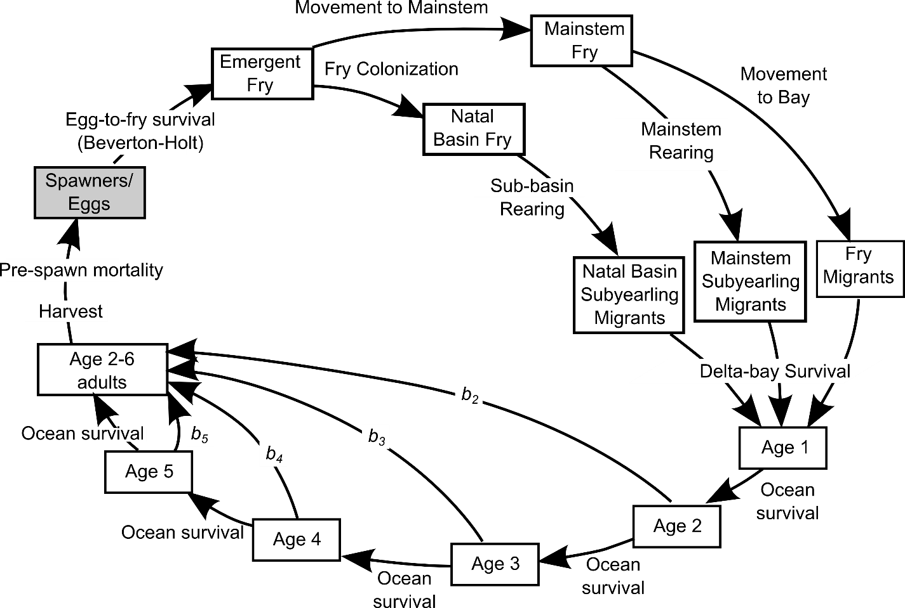

```{r setup, include=FALSE}
# TO RUN THIS NOTEBOOK, FIRST RUN THE SPRING CHINOOK ASRP MODEL WITH STOCHASTICITY OFF

knitr::opts_chunk$set(echo = TRUE)
```

```{r, echo=FALSE}

print_nicely <- function(x){
 tibble(basins = names(x),
        value = x)
}

```

The goal of this document is to walk through the Chinook lifecycle, with each stage populated at the level of $N_{eq}$. 


# Conceptual chinook lifecycle
The conceptual Chinook lifecycle is shown below. The boxes represent the lifestages, and the arrows represent transitions between lifestages, which are either density independent, hockey stick (spawning only) or Beverton Holt. Note there are two groups of recruits created from a BH transition, *recruits* and *density dependent movers*



In pseudo code format this can be written as

```{r, eval=FALSE}
spawners           <- spawners[year.i-1] # spawners from previous year

eggs               <- hs.func(spawners, asymptote = egg.cap, slope = fecund/2) # spawners -> eggs, hockey stick
pre.fry            <- eggs * egg.fry.surv # Eggs --> freshly emerged fry, density independent
natal.fry          <- move.fish(fish.in = em.fry, spring.movement.rules) # move emerged fry to mainstem
nn.fry             <- (pre.fry * weekly.surv) - natal.fry # Non natal fry, density dependent movers
nn.fry.to.ms       <- non.natal.fry[to.ms.reaches]
nn.fry.to.bay.grp1 <- non.natal.fry[to.bay.reaches] # Group 1
natal.sub.yr.grp3  <- BH.func(S = natal.fry, p = weekly.surv^7, c = cap) # Group 3

# Non natal subyearlings - only upper watershed fish that migrated to ms reaches
nn.fry.dist        <- distribute.fish(nn.fry.to.ms, move.matrix) # Distribute non-natal fry
nn.sub.yr.grp5     <- BH.func(S = nn.fry.dist, p = weekly.surv^7, c = cap - natal.sub.yr.grp3) # Group 5
nn.sub.yr.grp5.redist <- reallocate.fish(non.natal.sub.yr.grp5, return.rules) # Re-distribute non-natal subyearlings

# Fry migrants
natal.fry.mig.grp2 <- (natal.fry * weekly.surv^1) - natal.sub.yr.grp3 # Group 2
nn.fry.mig.grp4    <- (nn.fry.dist * weekly.surv^1) - non.natal.sub.yr.grp5 # Group 4
nn.fry.mig.grp4.redist <- reallocate.fish(nn.fry.mig.grp4, return.rules) 

# Sum all fry migrants and subyearlings
fry.migrants       <- nn.fry.to.bay.grp1 + nn.fry.mig.grp4.redist + natall.fry.mig.grp2
sub.yr             <- natal.sub.yr.grp3 + nn.sub.yr.grp5.redist

# Downstream migration for subyearlings (4, 2 or 0 weeks)
# 3 weeks of survival with june temperatures, the 4 week fish get one week of survival without temperature
# Then raise that to either 1 (4 week basins) or 0 (0 and 2 week basins)
sub.yr.ds <- sub.yr * 
  colSums(move.matrix * weekly.surv[ms.reaches])^ds_weeks * # average survival without temperature
  colSums(move.matrix * weekly.surv.temp[ms.reaches])^ds_weeks_june # with temperature

# Apply bay survival (ds migration, delta, bay, nearshore productivity)
fry.migrants.bay <- fry.migrants * bay.fry.surv
sub.yr.bay <- sub.yr.ds * bay.parr.surv

# Ocean survival
mat.new['ocean0', ] <- fry.migrants.bay + sub.yr.bay # smolts leaving bay, ocean0
mat.new['ocean1', ] <- mat[1, ] * So.func(so.1[1], so.1[2]) # 2 year olds, ocean1
mat.new['ocean2', ] <- mat[2, ] * (1 - b2) * So.func(so.2[1], so.2[2]) # 3 year olds, ocean2
mat.new['ocean3', ] <- mat[3, ] * (1 - b3) * So.func(so.3[1], so.3[2]) # 4 year olds, ocean3
mat.new['ocean4', ] <- mat[4, ] * (1 - b4) * So.func(so.4[1], so.4[2]) # 5 year olds, ocean4
mat.new['ocean5', ] <- mat[5, ] * (1 - b5) * So.func(so.5[1], so.5[2]) # 6 year olds, ocean5

mat.new['total.run',] <- b2 * mat['ocean1', ] + b3 * mat['ocean2', ] + b4 * mat['ocean3', ] + b5 * mat['ocean4',] + mat['ocean5', ] #Total run
mat.new['spawners',] <- mat.new['total.run', ] * (S.up) # Spawners

```

Below here, we will walk through each step. The code below is true code, and so results that are displayed are calculated live in this example. 

## Read in data
The fist step is read in the productivity and capacity values which will be used to parameterize each transition. Those productivities and capacities are stored in a `habitat.sceanrio` file. We will use `Current.csv`.

```{r}
dat <- read.csv('../../outputs/spring_chinook/hab.scenarios/Current.csv', header = TRUE, row.names = 2) %>%
  select(-X)

colnames(dat) <- reach.names
dat <- as.matrix(dat)
dat[is.na(dat)] <- 0

dat[, c(1,5,12,18)] %>% round(3) # Display a subset of dat

```
From here, we assign each variable to a `vector`, or list of numbers 63 long. That way when we use one equation (e.g. `eggs * egg.to.fry.survival`) our input and output will both be length 63. 

```{r}

egg.cap <- dat["eggs", ] # Egg capacity
egg.fry.surv <- dat["eggtofry_surv", ] # Egg to fry survival

# Juvenile rearing survival and capacity
weekly.surv <- dat['surv_s', ]^(1/8) # 1 week of freshwater mortality
cap <- dat['capacity_s', ]

# Weekly productivity scaled with June temperatures
# This is weighted so that 45% of fish will get the impact of temperature
weekly.surv.temp <- (0.45 * dat['surv_s_2', ]^(1/8)) + (.55 * weekly.surv)

S.up <- dat['prespawn_surv', ] # prespawn survival


```

## Spawners
To start the lifecycle, the input is a numbers of spawners per subbasin. We will use the `spawners` column and the `Current` scenario in the standard model outputs `coho_abundance_by_subbasin.csv`. This gives us a row of numbers or `vector`, of length 63, with integer values for the number of spawners per subbasin. A value of 0 means there are no spawners which return to that basin. 
```{r}

spawners <- read.csv('../../outputs/spring_chinook/lcm/spring.chinook_abundance_by_subbasin.csv') %>%
  filter(scenario == 'Current') %>%
  pull(spawners)

names(spawners) <- reach.names

spawners[spawners > 0]  %>% print_nicely() 

```

## Eggs
To calculate the number of eggs, we use the hockey-stick egg function `eggs.func()` to transition spawners into eggs. The numbers of eggs produced is calculated by multiplying the number of spawners by fecundity (2500). This increases linearly until egg capacity is reached, at which point more spawners does not result in more eggs. Note `spawners` and `egg.cap` are unique to each of the 63 basins, but fecundity is fixed. 

```{r}

eggs <- eggs.func(spawners, egg.total = egg.cap, fecund = fecund) 

eggs[c(1,5,12,18)]
```

## Pre fry
Eggs to pre fry `pre.fry` is a density independent step. We multiply the egg abundance by egg to fry survival.

```{r}
pre.fry <- eggs * egg.fry.surv
pre.fry[c(1,5,12,18)]
```

## Natal and non-natal fry
All `pre.fry` move through a Beverton Holt to transition into both `natal.fry` and density dependent movers, non-natal fry `nn.fry`. In spring Chinook, as there are no spawners below Satsop, all `nn.fry` move to the mainstem. 

```{r}
# Natal fry - All basins
natal.fry <- BH.func(S = pre.fry, p = weekly.surv, c = cap * 2) # Density dependent survival in fresh (first week after fry), 3x capacity
natal.fry[c(1,5,12,18)]
```

```{r}
# Non natal fry
non.natal.fry <- (pre.fry * weekly.surv) - natal.fry # Density dependent slice to create non natal fry
non.natal.fry[c(1,5,12,18)]
```

## Natal subyearlings (3) and natal fry migrants (2)
Next, all `natal.fry` go through a density dependent 7 week rearing period to become subyearlings. There are also density dependent movers, `natal.fry.migrants` which come from this stage. 

```{r}
# Natal sub yearlings - all basins
natal.sub.yr <- BH.func(S = natal.fry, p = weekly.surv^7, c = cap * 2) # Group 3
natal.sub.yr[c(1,5,12,18)]

```

```{r}
natal.fry.migrants <- (natal.fry * weekly.surv^1) - natal.sub.yr # Group 2
natal.fry.migrants[c(1,5,12,18)]
```


## Non-natal subyearlings (5) and non-natal fry migrants (4)
All `non.natal.fry` also go through a density dependent 7 week rearing period to become subyearlings. The difference is rather than experiencing the $p$ and $c$ of their natal basin, they are moved down to the mainstem. In order to not introduce too much density dependence on the natal mainstem juveniles, the non-natal fish go into a different BH than the `natal.fry`, where $c$ is is `cap - natal.sub.yr`. 


```{r}
non.natal.fry.dist <- distribute.fish(non.natal.fry, move.matrix) # spread the non-natal fry into the mainstem
non.natal.fry.dist[, c(12,18, 57)]
```

Once the fish have been spread into the mainstem, they go through a fry to subyearling Beverton Holt. 

```{r}
non.natal.sub.yr <- BH.func(S = non.natal.fry.dist[2,], p = weekly.surv^7, c = cap * 2 - natal.sub.yr) # Group 5
non.natal.sub.yr[c(56,57,58,59)]
```

Then we reassign the non-natal subyearlings to their natal basin.

```{r}
non.natal.sub.yr.redist <- reallocate.fish(non.natal.sub.yr, redist.matrix = non.natal.fry.dist[return.rows,])[2, ]
non.natal.sub.yr.redist[c(12,18, 56, 57)]
```

Similar to the natal subyearlings, the non-natal fry are the density dependent movers from the non-natal fry transition to non-natal subyearlings. 

```{r}
non.natal.fry.migrants <- (non.natal.fry.dist[2,] * weekly.surv^1) - non.natal.sub.yr # Group 4
non.natal.fry.migrants[c(56,57,58,59)]
```

Then we reassign the non-natal fry to their natal basins.

```{r}
non.natal.fry.migrants.redist <- reallocate.fish(non.natal.fry.migrants, redist.matrix = non.natal.fry.dist[return.rows, ])[2, ] # Re-distribute non-natal subyearlings
non.natal.fry.migrants.redist[c(12,18, 56, 57)] %>% round(3)
```

## Downstream migration
For spring Chinook all subyearlings have a 4 week downstream migration period. During this period weekly survival is augmented to reflect that 50% of fish experience the mean daily maximum temperature between June 1 and June 21 `weekly.surv.temp`. Each basin is given the average `weekly.surv.temp` of all mainstem units downstream of the basin. 

```{r}
sub.yr.ds <- c(natal.sub.yr + non.natal.sub.yr.redist) * # sum group 3 and group 5
             colSums(move.matrix * weekly.surv[ms.reaches])^ds_weeks * # average survival without temperature
             colSums(move.matrix * weekly.surv.temp[ms.reaches])^ds_weeks_june # with temperature

sub.yr.ds[c(1,5,12,18)]
```

## Bay survival
Fry and subyearling migrants get a different bay survival. 

```{r}
fry.migrants.bay <- c(non.natal.fry.migrants.redist + natal.fry.migrants) * bay.fry.surv
sub.yr.bay <- sub.yr.ds * bay.parr.surv
```


## Age structured return
Chinook have an age structured return

```{r}
# Ocean survival
age1 <- fry.migrants.bay + sub.yr.bay # smolts leaving bay, ocean0
age2 <- age1 * So.func(so.1[1], so.1[2]) # 2 year olds, ocean1
age3 <- age2 * (1 - b2) * So.func(so.2[1], so.2[2]) # 3 year olds, ocean2
age4 <- age3 * (1 - b3) * So.func(so.3[1], so.3[2]) # 4 year olds, ocean3
age5 <- age4 * (1 - b4) * So.func(so.4[1], so.4[2]) # 5 year olds, ocean4
age6 <- age5 * (1 - b5) * So.func(so.5[1], so.5[2]) # 6 year olds, ocean5
```

Total run and spawners

```{r}
total.run <- (b2 * age2 + b3 * age3 + b4 * age4 + b5 * age5 + age6) #Total run
recruits  <- total.run * (S.up) # Spawners
```

```{r}
tibble(natal.basin = names(recruits),
       spawners = spawners,
       recruits = recruits %>% round(0))
```


```{r}
# total.run / (sub.yr.ds + non.natal.fry.migrants.redist + natal.fry.migrants)
```

